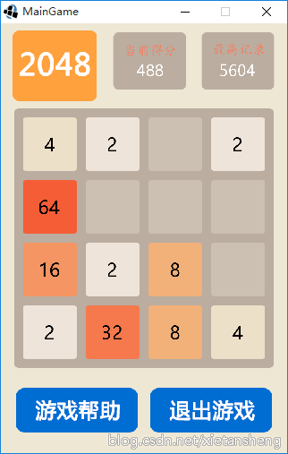
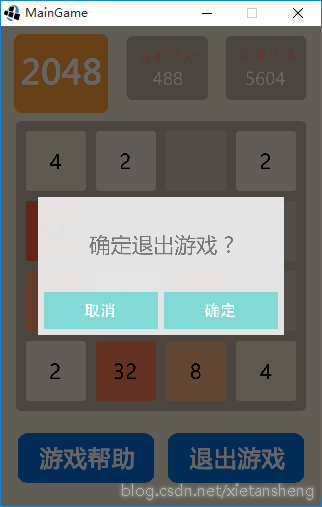

# Game2048ForGDX
使用跨平台游戏开发框架 LibGDX 开发的 2048 游戏。

**声明**： 游戏中使用到的部分图片和音频资源来自网络，资源版权和游戏创意属原作者，这里仅供学习交流。

## 概述

2048 是一款非常热门的数字益智类游戏，操作规则很简单，在屏幕中有四行四列共 16 个卡片，初始时随机在其中两个卡片生成两个数字 2 或 4，然后手指可在卡片组区域 上下左右滑动 将所有卡片移动到 上侧 / 下侧 / 左侧 / 右侧。如果在移动的方向上有数字相同并连着的两个卡片发生“碰撞”，则这两个卡片的数字相加合并成一个卡片，每移动完一次随机在一个空白卡片处生成一个数字 2 或 4。通过不断移动卡片，直到拼凑出数字为 2048 的卡片，则游戏胜利；如果卡片不可再移动（没有空白卡片）又没有拼凑出数字为 2048 的卡片，则游戏结束。

## 游戏效果展示

HTML5 平台在线演示（浏览器需要支持 WebGL）： [http://xietansheng.github.io/Game2048ForGDX/](http://xietansheng.github.io/Game2048ForGDX/)

Desktop 平台项目运行截图：

 

## 详细介绍

[http://blog.csdn.net/xietansheng/article/details/50188259](http://blog.csdn.net/xietansheng/article/details/50188259)
